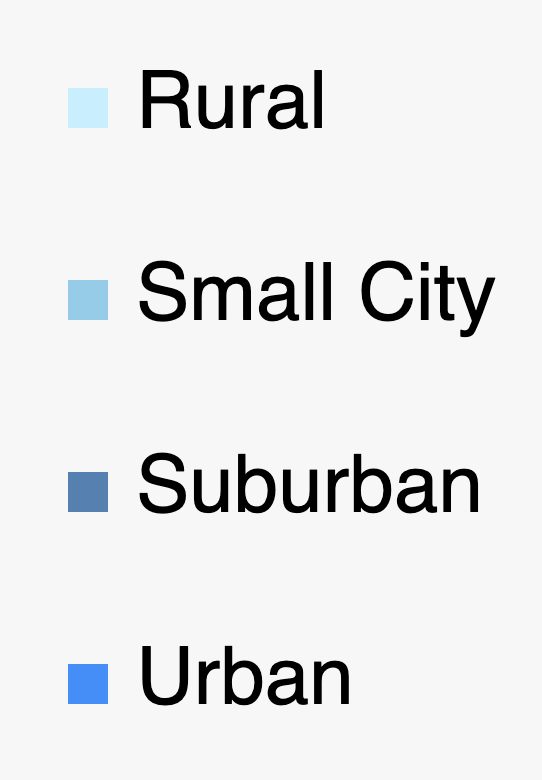

# Health In The USA - Documentation

#### Author: Nishit Grover(M15329773)

## Introduction:

The Health in the USA project aims to create an interactive visualization application to help users explore the factors influencing health across different counties in the United States. By leveraging data from the US Heart and Stroke Atlas, users can gain insights into various economic, environmental, behavioral, demographic, healthcare, and health-related factors affecting communities.

## Data

The primary dataset for this project is sourced from the US Heart and Stroke Atlas, accessible via the CDC website. The dataset encompasses a range of attributes for each county in the USA, including economic indicators, environmental factors, demographics, healthcare access, and health conditions. The data file can be found [here](https://www.cdc.gov/dhdsp/maps/atlas/index.htm).

The attributes used in the project are as follows:

- display_name: County name, including the state abbreviation, facilitating easy identification.
- poverty_perc: The proportion of the county's population living below the poverty line.
- median_household_income: The median income earned by households within the county.
- education_less_than_high_school_percent: The percentage of the population without a high school diploma or equivalent education.
- air_quality: A measure indicating the quality of air or air pollution levels, often represented by the Air Quality Index (AQI).
- park_access: The availability and accessibility of parks and recreational areas within the county.
  percent_inactive: The proportion of the population leading a sedentary lifestyle, lacking regular physical activity.
- percent_smoking: The rate of smoking among the county's population.
- urban_rural_status: Classification of counties based on population density and development, categorized as rural, urban, suburban, or small city.
- elderly_percentage: The percentage of the population classified as elderly, typically aged 65 and above.
- number_of_hospitals: The count of hospitals within the county, indicating the healthcare infrastructure.
- number_of_primary_care_physicians: The count of primary care physicians available within the county.
- percent_no_heath_insurance: The percentage of the population lacking health insurance coverage.
- percent_high_blood_pressure: The percentage of high blood pressure within the county's population.
- percent_coronary_heart_disease: The occurrence of coronary heart disease within the county's population.
  percent_stroke: The occurrence of stroke within the county's population.
- percent_high_cholesterol: The percentage of the population with high cholesterol levels within the county.

## Visuals:

Users can compare distributions of selected attributes through histograms or bar charts, examine correlations between attributes using scatterplots, and visualize spatial distributions of data through choropleth maps. By interacting with the UI elements, users can dynamically update the visualizations to explore different combinations of attributes and gain insights into relationships between various factors influencing health outcomes.

- Firstly, I have a form element that lets the user choose the attributes they want to compare. I also have a submit and reset button which allows the user to submit their selections for comparison and reset the form to its default state, respectively.

- My color scheme runs across City Area Types, starting from light blue for Rural to Dark Blue for Urban.

- The first graph is Correlation visualization (scatterplot), which displays the relationship between two selected attributes, showing how their values correlate with each other.
  This scatterplot has a legend which also works as a filter to filter out the City area type.
  I also have a tooltip enabled in this graph, so If a user hovers over a specific circle, they will a tooltip popup that displays what county they are hovering over, followed by the median income in that county and exact values of the attributes they have chosen.
  The scales on the axis and the axis label are dynamically adjusted to the attributes chosen.

- Following the scatterplot, we have two Spatial Distribution (Choropleths) side by side. Choropleths are maps that utilize color gradients or shading to represent the distribution of a specific variable across geographic regions, such as counties. In this context, these Choropleths provide an overview of how selected attributes vary across different counties in the United States. By positioning them side by side, users can easily compare the spatial patterns and disparities in these attributes, facilitating a deeper understanding of geographical trends and variations in health-related factors. Yet, again we have a tooltip working for Choropleths when hovered they show the County and the value percentage of the attribute selected.

- Concluding our visualization suite, we present a set of Histograms arranged side by side. Histograms are graphical representations that display the distribution of numerical data through bars, where each bar represents a range of values of the user-selected attributes and the height of the bar indicates the frequency of counties falling within that range. In this context, the histograms offer insights into the distribution patterns of selected attributes across the dataset. By organizing them side by side, users can compare the distributions of these attributes more easily, identifying any commonalities or disparities between them. We also have a tooltip enabled for these graphs.

## Brushing and Linking

Another User-friendly tool we have is brushing. Brushing is like using a highlighter on specific points of interest in our scatterplot. When you do this, the related counties light up on the maps, and the histograms adjust to show information just for those highlighted areas. It helps you focus on certain data points and see how they relate to each other across different visualizations.

## Interesting Discoveries

When comparing the correlation between the poverty percentage and the percentage of people without health insurance, we observe that in rural areas, the concentration ranges from 4% to 24%. However, in urban areas, there is no specific concentration range noticeable.

Another surprising discovery was that, in the broader context, the eastern side of the US exhibits higher smoking rates compared to the western side. However, when considering stroke percentages, which might be expected to be higher on the east side, they are surprisingly consistent throughout the country.

I would also like to discuss the significant difference in park access between the west coast and the east coast, where the west coast typically has 5-10 times more park access than the east coast.

## Library Used and Code Structure:
   The project utilizes D3.js, JavaScript, HTML, and CSS for development. The code is structured to facilitate ease of maintenance and scalability. 
 * The application is hosted online and can be found at [here](https://app.netlify.com/sites/spectacular-travesseiro-41aff1/overview
   ) 
 * Working Video: [Here](https://mailuc-my.sharepoint.com/:v:/r/personal/grovernt_mail_uc_edu/Documents/VIS%20Spring%2724/Screen%20Recording%202024-02-29%20at%2010.05.40%E2%80%AFPM.mov?csf=1&web=1&nav=eyJyZWZlcnJhbEluZm8iOnsicmVmZXJyYWxBcHAiOiJPbmVEcml2ZUZvckJ1c2luZXNzIiwicmVmZXJyYWxBcHBQbGF0Zm9ybSI6IldlYiIsInJlZmVycmFsTW9kZSI6InZpZXciLCJyZWZlcnJhbFZpZXciOiJNeUZpbGVzTGlua0NvcHkifX0&e=sNhd4f)  

## Code Structure:
   Index.html: Basic html file with information about the header and includes the form element to fetch the data from the user.

- CSS

  - style.css: Main styling file

- Data

  - counties-10m.json: Used in creation of choropleths
    national_health_data.csv: Raw data

- Js
  - choropleth.js/choropleth2.js: code containing the choropleth class along with its associated brushing and tooltip functions.
  - Bar.js/bar2.js: code containing the Histogram class along with its associated brushing and tooltip functions.
  - scatterplot.js: code containing the scatterplot class along with all its brushing and tooltip functionalities.
  - main.js: The main.js file helps load all the data and parse it to its respective class. It also handles any error while loading the data
  - d3.v6.min.js: file to import D2
  - topojson.v3.js: Compulsory file for choropleth

## Future Works:

In the future, we could explore incorporating features such as interactive filters to allow users to refine their data views, tooltips for providing additional context on data points, or the integration of dynamic data updates to keep information current

## Challenges

I am yet to enable brushing on Choropleths and Histogram. Another challenge I faced while working on the project was to clean and filter the large dataset.
